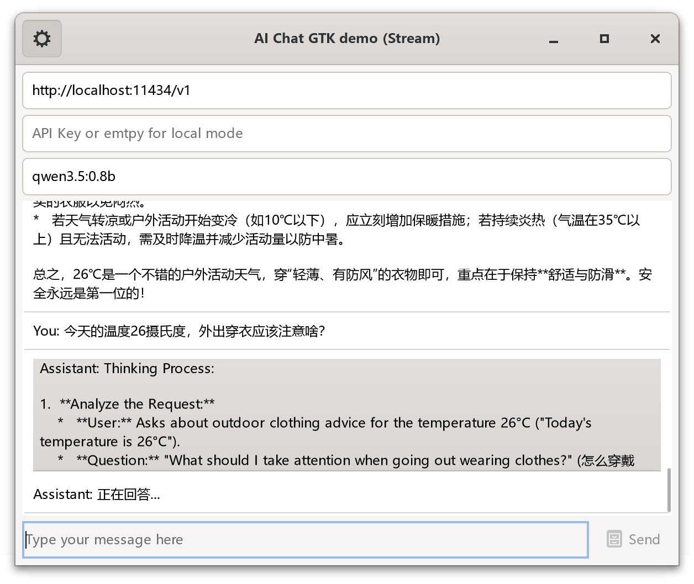

# AI chat GTK demo with stream support
AI chat GTK demo app to show GTK4 / Vala / libsoup3 , the key code is make for testing for the project [Kangaroo Database Tool](https://github.com/dbkangaroo/kangaroo)


## Dependencies
- libsoup-3.0
- json-glib-1.0
- Vala
- GTK4

## Genereate the initial code with AI model `GLM 5` 
```text
请基于 libsoup-3.0 / json-glib-1.0 / Vala / GTK4 创建一个简单的、兼容 OpenAI API 的聊天应用，优先使用本地 Ollama 模型API，要支持异步、流式返回数据，代码要完整，构建工具使用 meson，要能直接编译并测试。
```

## Refactor the code with UI resource

## Compile with MSYS2 environment
pacman -Syu
pacman -S base-devel autotools git mingw-w64-ucrt-x86_64-gettext-tools mingw-w64-ucrt-x86_64-toolchain mingw-w64-ucrt-x86_64-vala mingw-w64-ucrt-x86_64-libpanel mingw-w64-ucrt-x86_64-gtksourceview5 mingw-w64-ucrt-x86_64-meson mingw-w64-ucrt-x86_64-cmake mingw-w64-ucrt-x86_64-libgee mingw-w64-ucrt-x86_64-json-glib mingw-w64-ucrt-x86_64-libarchive mingw-w64-ucrt-x86_64-libpeas2 mingw-w64-ucrt-x86_64-template-glib mingw-w64-ucrt-x86_64-libtree-sitter mingw-w64-ucrt-x86_64-tree-sitter mingw-w64-ucrt-x86_64-uchardet mingw-w64-ucrt-x86_64-libsoup3 mingw-w64-ucrt-x86_64-editorconfig-core-c mingw-w64-ucrt-x86_64-qrencode mingw-w64-ucrt-x86_64-libshumate mingw-w64-ucrt-x86_64-libfido2 mingw-w64-ucrt-x86_64-desktop-file-utils mingw-w64-ucrt-x86_64-appstream-glib mingw-w64-ucrt-x86_64-dlfcn mingw-w64-ucrt-x86_64-imagemagick mingw-w64-ucrt-x86_64-gobject-introspection

## Build and run
meson setup build
meson compile -C build/
./build/ai-chat-gtk4.exe &

## ScreenShots of Kangaroo database tool app
[](https://www.datatable.online/)
